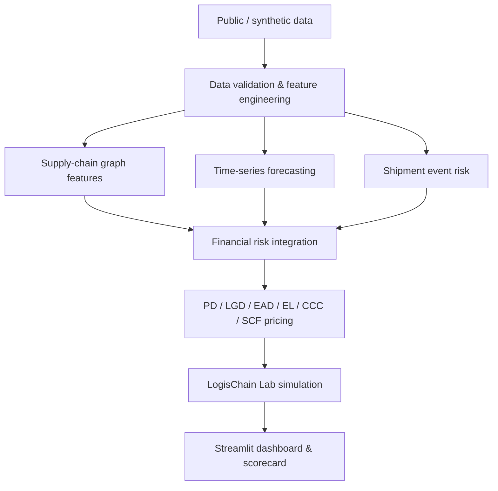

# Architecture

```mermaid
flowchart TD
 A[Public / synthetic data] --> B[Data validation & feature engineering]
 B --> C[Supply-chain graph features]
 B --> D[Time-series forecasting]
 B --> E[Shipment event risk]
 C --> F[Financial risk integration]
 D --> F
 E --> F
 F --> G[PD / LGD / EAD / EL / CCC / SCF pricing]
 G --> H[LogisChain Lab simulation]
 H --> I[Streamlit dashboard & scorecard]
```
